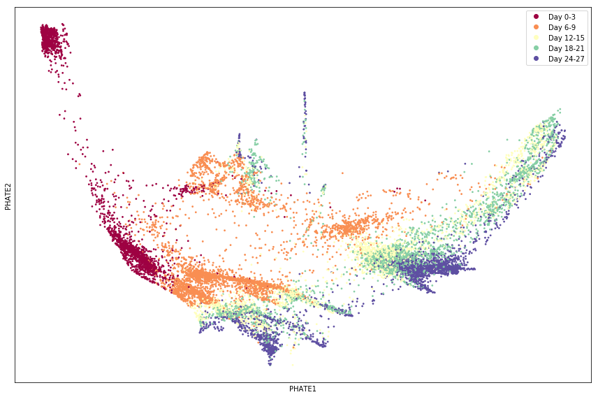
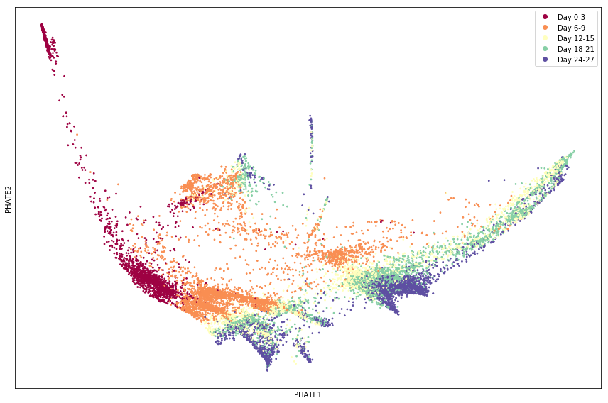
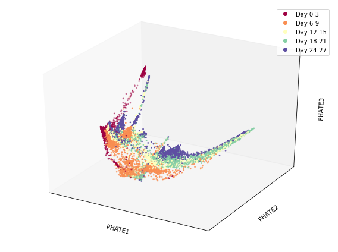
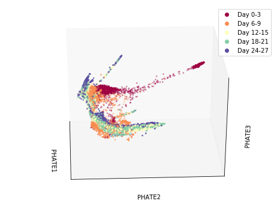

## 1. PHATE

Download code for the PHATE visualization tool at `github.com/KrishnaswamyLab/PHATE`. Download the `EBdata2.mat` file from Canvas. This data file contains a sparse matrix labeled ``data'', a vector labeled ``cells'', and a vector labeled ``libsize''. The data matrix contains cleaned single-cell RNA-sequencing data from embryoid bodies with 16,825 cells and 17,580 genes. The cells vector indicates which time point the cell was extracted from. The libsize vector gives the sum of each row in the data matrix which will be used to normalize the data. You will apply PHATE to visualize this data.

a.  Load the data. Indicate what packages or libraries you used. In particular, the data matrix is saved as a sparse Matlab matrix.

Data loaded. I did this problem in python and used the `scprep`, `numpy`, `pandas`, and `phate` libraries. 

b.  Normalize the data using the libsize (stands for library size) vector. To do this, divide each entry in the $i$th row of the data matrix by the $i$th entry in the libsize vector.  

Completed.

c. Run PHATE on the data using default parameters. Plot the PHATE coordinates colored by time point (the "cells" vector) and include the plot. Note: For single-cell data (like this data), we tend to get better results when we take the square root of each entry in the data matrix first. If you get a big "swoosh"", then this is probably what's wrong. 

```{r, fig.align = "center", out.width="80%"}
library(knitr)


```
Default parameters: $t = 21$, $k = 5$, $a = 40$, $gamma = 1$.

d. Run PHATE on the data using a different value of $t$. Plot the PHATE coordinates colored by time point and include the plot. Based on the results, do you think your chosen value of t is better than the parameter chosen using the ``knee point'' of the VNE plot (the value chosen using default parameters)? Will the VNE be higher or lower for your chosen value of $t$ than that selected in part (b)? 

```{r, fig.align = "center", out.width="80%"}

```

The above PHATE visualization was created with a value of $t = 15$. To me, the structure looks more distinct and 'tight' than when we let $t$ = 21, so I would guess that the VNE would be lower when $t = 15$. This is a good thing, so I do think that choosing $t = 15$ is a better value of $t$ for these data. 

e. Run PHATE on the data using default parameters to obtain 3d coordinates. Plot the 3d coordinates. You may need to rotate the plot to get a good view.

Here is the 3d PHATE visualization at the default angle. 

```{r, fig.align = "center", out.width="100%"}

```

And here is the 3d PHATE visualization at a different angle. 

```{r, fig.align = "center", out.width="100%"}

```

**Code for Exercise 1**

```{python, eval = FALSE}
# Import the data (code given on the tutorial website at:
# https://github.com/KrishnaswamyLab/PHATE/blob/master/Python
#        /tutorial/EmbryoidBody.ipynb)
import os
import zipfile
from urllib.request import urlopen
download_path = os.path.expanduser("~")
print(download_path)

if not os.path.isdir(os.path.join(download_path, "scRNAseq", "T0_1A")):
    if not os.path.isdir(download_path):
        os.mkdir(download_path)
    zip_data = os.path.join(download_path, "scRNAseq.zip")
    if not os.path.isfile(zip_data):
        with urlopen("https://data.mendeley.com/datasets/v6n743h5ng"
                     "/1/files/7489a88f-9ef6-4dff-a8f8-1381d046afe3"
                     "/scRNAseq.zip?dl=1") as url:
            print("Downloading data file...")
            # Open our local file for writing
            with open(zip_data, "wb") as handle:
                handle.write(url.read())
    print("Unzipping...")
    with zipfile.ZipFile(zip_data, 'r') as handle:
        handle.extractall(download_path)
    print("Done.")

# import libraries
import pandas as pd
import numpy as np
import phate
import scprep

# Import data into pandas dataframe
sparse=True
T1 = scprep.io.load_10X(os.path.join(download_path,"scRNAseq", "T0_1A"),
                        sparse=sparse,
                        gene_labels='both')
T2 = scprep.io.load_10X(os.path.join(download_path, "scRNAseq", "T2_3B"),
                        sparse=sparse,
                        gene_labels='both')
T3 = scprep.io.load_10X(os.path.join(download_path, "scRNAseq", "T4_5C"),
                        sparse=sparse,
                        gene_labels='both')
T4 = scprep.io.load_10X(os.path.join(download_path, "scRNAseq", "T6_7D"),
                        sparse=sparse,
                        gene_labels='both')
T5 = scprep.io.load_10X(os.path.join(download_path, "scRNAseq", "T8_9E"),
                        sparse=sparse,
                        gene_labels='both')
T1.head()

# combine datasets 
EBT_counts, sample_labels = scprep.utils.combine_batches(
    [T1, T2, T3, T4, T5], 
    ["Day 0-3", "Day 6-9", "Day 12-15", "Day 18-21", "Day 24-27"],
    append_to_cell_names=True
)
del T1, T2, T3, T4, T5 # removes objects from memory
EBT_counts.head()

# Remove (suspected) dead cells
# Get mitochondrial genes.
mito_genes = scprep.utils.get_gene_set(EBT_counts, starts_with="MT-") 
scprep.plot.plot_gene_set_expression(EBT_counts, mito_genes, percentile=90)

# Plot number of cells that have a certain amount of mitochondrial RNA,
# remove cells that are above the 90th percentile. (Line below)
EBT_counts, sample_labels = scprep.filter.filter_gene_set_expression(
    EBT_counts, mito_genes, 
    percentile=90, 
    keep_cells='below', 
    sample_labels=sample_labels)

# Filter out genes with low counts
scprep.plot.plot_library_size(EBT_counts, percentile=20)
EBT_counts, sample_labels = scprep.filter.filter_library_size(
    EBT_counts, percentile=20, 
    keep_cells='above', 
    sample_labels=sample_labels,
    filter_per_sample=True)
EBT_counts, sample_labels = scprep.filter.filter_library_size(
    EBT_counts, percentile=75, 
    keep_cells='below', 
    sample_labels=sample_labels,
    filter_per_sample=True)

# Now remove rare genes (genes expressed in 10 or fewer cells)
EBT_counts = scprep.filter.remove_rare_genes(EBT_counts, min_cells=10)
# Normalization: accounting for differences in library sizes, divide each cell
# by its library size and then rescale by the median library size.
EBT_counts = scprep.normalize.library_size_normalize(EBT_counts)

# Transformation: use square root transform (similar to using log transform
# but has the added benefit of dealing with 0's automatically).
EBT_counts = scprep.transform.sqrt(EBT_counts)


# Default parameters for the PHATE function are:
# k: number of nearest neighbors, default is 5
# a: alpha decay, default is 40
# t: number of times to power the operator, default "auto", 21 for these data
# gamma: informational distance constant, default is 1.
phate.PHATE()

phate_operator = phate.PHATE(n_jobs=-2)
Y_phate = phate_operator.fit_transform(EBT_counts)

# Now plot using phate.plot.scatter2d
phate.plot.scatter2d(Y_phate, c=sample_labels, s=3, figsize=(12,8), cmap="Spectral")

# Set another value of t. I chose t = 15
phate_operator.set_params(k=4, t=15, a=15)
# We could also create a new operator:
# phate_operator = phate.PHATE(k=4, t=12, a=15, n_jobs=-2)

Y_phate = phate_operator.fit_transform(EBT_counts)

# Now plot using phate.plot.scatter2d having used t = 15
phate.plot.scatter2d(Y_phate, c=sample_labels, s=3, figsize=(12,8), cmap="Spectral")

# 3D scatterplot. 
phate.plot.scatter3d(phate_operator, c=sample_labels, s=3, figsize=(8,6), cmap="Spectral")
# This saves the 3D plot as a gif

#phate.plot.rotate_scatter3d(phate_operator, c=sample_labels, 
#                             s=3, figsize=(8,6), cmap="Spectral", filename="phate.gif")

# This saves the 3D plot as an MP4 
phate.plot.rotate_scatter3d(phate_operator, c=sample_labels, 
                            s=3, figsize=(8,6), cmap="Spectral", filename="phate.mp4")


```

## 2. Spectral Clustering and GMM

Download all of the data for the MNIST dataset from `yann.lecun.com/exdb/mnist/`. This should give you 60,000 images in the training data and 10,000 images in the test data. You will apply a couple of clustering algorithms to this dataset. You may use any existing packages or libraries for this problem. For all parts, you may assume the same number of clusters as classes 

a. Apply k-means clustering to just the features of the training data (do not include labels). Compute the adjusted Rand index (ARI) between your cluster outputs and the true labels of the data points and report the value. Note: You may need to do subsampling to make this computationally feasible. If you do, repeat the clustering for multiple (say 10-20) subsamples and report the average ARI.

I took subsamples of 2000 observations from the training data, and performed k-means clustering 15 times. The average ARI was 0.3673.

b. Apply spectral clustering to just the features of the test data (do not include labels) using a radial or Gaussian kernel. Compute the ARI between your cluster outputs and the true labels of the data points. Use the ARI to tune the kernel bandwidth parameter. Report the ARI using your selected bandwidth. Note: You will likely need to do subsampling to make this computationally feasible. If you do, repeat the final clustering for multiple subsamples and report the average ARI. 

Applying k-means clustering to the test data yielded an ARI of 0.3822

c. Apply spectral clustering to just the features of the training data (do not include labels) using a radial or Gaussian kernel. Compute the ARI between your cluster outputs and the true labels of the data points. Use the ARI to tune the kernel bandwidth parameter. Report the ARI using your selected bandwidth. Note: You will likely need to do subsampling to make this computationally feasible. If you do, repeat the final clustering for multiple subsamples and report the average ARI. 

After tuning the `sigma` parameter (related to bandwidth) to a value of $3.99 \times 10^-6$, I took subsamples of 2000 observations from the training data and performed spectral clustering 15 times. The average ARI was 0.4114

d. Apply spectral clustering to the features of the test data using the same kernel and bandwidth you selected in part (b). Report the ARI.

Applying spectral clustering with the tuned `sigma` parameter to the test data yielded an ARI of 0.5113.

e.  Learn a Gaussian mixture model from the training data using the EM algorithm to cluster the data. Calculate and report the ARI. Note: You may need to do subsampling to make this computationally feasible. If you do, repeat the clustering for multiple (say 10-20) subsamples and report the average ARI.

I took subsamples of 500 observations from the training data (for computational feasability), and performed spectral clustering 15 times. The average ARI was 0.3221.

f.  Learn a Gaussian mixture model from the test data to cluster the data. Calculate and report the ARI.

I took subsamples of 500 observations from the test data (for computational feasability), and performed spectral clustering 15 times. The average ARI was 0.3269.

g. Based on the reported ARI numbers, which clustering algorithm seems to work the best on this data? 

Below is a table summarizing the ARI values for the training and test data for each respective algorithm. 

ARI Values:  

Clustering Algorithm   | Training | Test
-----------------------|----------|-----
$k$-means clustering   | 0.3673   | 0.3822
Spectral clustering    | 0.4114   | 0.5113
Gaussian mixture models| 0.3221   | 0.3269

From my results, it appears that spectral clustering works the best on these data. 


f.  Generally when we're clustering data, we don't have access to the true labels which makes it difficult to tune parameters like the kernel bandwidth. What is another way you could tune the bandwidth without using cluster or class labels?

I think you would still need to use some sort of metric for measuring desired performance. One idea I had was that if you have a 'ballpark' estimate for how many clusters you expect to see in your data, you could tune the bandwith until you see about that many clusters. 

**Code for exercise 2**
```{r, eval = FALSE}
library(mclust)
library(dplyr)
library(kernlab)
library(speccalt)
library(kknn)
library(fcd)

################################################################################
### Read in and Format data ####################################################
################################################################################

# need R.utils package installed and files downloaded in working directory. 

# gunzip the files
# R.utils::gunzip("train-images-idx3-ubyte.gz")
# R.utils::gunzip("train-labels-idx1-ubyte.gz")
# R.utils::gunzip("t10k-images-idx3-ubyte.gz")
# R.utils::gunzip("t10k-labels-idx1-ubyte.gz")


# helper function for visualization
show_digit = function(arr784, col = gray(12:1 / 12), ...) {
  image(matrix(as.matrix(arr784[-785]), nrow = 28)[, 28:1], col = col, ...)
}


# load image files
load_image_file = function(filename) {
  ret = list()
  f = file(filename, 'rb')
  readBin(f, 'integer', n = 1, size = 4, endian = 'big')
  n    = readBin(f, 'integer', n = 1, size = 4, endian = 'big')
  nrow = readBin(f, 'integer', n = 1, size = 4, endian = 'big')
  ncol = readBin(f, 'integer', n = 1, size = 4, endian = 'big')
  x = readBin(f, 'integer', n = n * nrow * ncol, size = 1, signed = FALSE)
  close(f)
  data.frame(matrix(x, ncol = nrow * ncol, byrow = TRUE))
}

# load label files
load_label_file = function(filename) {
  f = file(filename, 'rb')
  readBin(f, 'integer', n = 1, size = 4, endian = 'big')
  n = readBin(f, 'integer', n = 1, size = 4, endian = 'big')
  y = readBin(f, 'integer', n = n, size = 1, signed = FALSE)
  close(f)
  y
}

# load images
train = load_image_file("train-images-idx3-ubyte")
test  = load_image_file("t10k-images-idx3-ubyte")

# load labels
train$y = as.factor(load_label_file("train-labels-idx1-ubyte"))
test$y  = as.factor(load_label_file("t10k-labels-idx1-ubyte"))

# view test image
show_digit(train[10000, ])

################################################################################
### Subsampling Generating functions ###########################################
################################################################################

# This function returns a random sub sample of from the specified data
genSubSample <- function(data, sample.size){
  smpl <- dplyr::sample_n(tbl = data, size = sample.size, replace = FALSE)
  return(smpl)
}

# ssamp <- genSubSample(train, 500)

################################################################################
### Generate subsamples for K-means and Spectral ###############################
################################################################################

set.seed(1234)

nsubsamp <- 15 # number of sub samples to generate
n <- 2000 # number of observations in each sub sample

# generate list of subsamples to be used in k-means clusting and spectral clustering
ss_list <- list()
for (i in 1:nsubsamp) {
  ss_list[[i]] <- genSubSample(test, sample.size = n)
}

################################################################################
### K-means Clustering - Training ##############################################
################################################################################

randInd.km.train <- double(15) # container to hold ARI values for each subsample

# Loop over subsamples 
counter <- 1
for(ss in ss_list){
  km.train <- kmeans(x = select(ss, -y), centers = 10, nstart = 20)
  randInd.km.train[counter] <- adjustedRandIndex(km.train$cluster, ss$y)
  counter <- counter + 1
}

mean(randInd.km.train)

################################################################################
### K-means Clustering - Test ##################################################
################################################################################

km.test <- kmeans(x = select(test, -y), centers = 10, nstart = 20)
adjustedRandIndex(km.test$cluster, test$y)

################################################################################
### Spectral Clustering - Training #############################################
################################################################################

# Tuning sigma parameter (related to bandwidth)

ssamp <- genSubSample(train, 500) # single subsample to be used in tuning
# sigma.grid <- 2*10^(-10:-5) # started with this grid: ARI max at 2e-06
sigma.grid <- 2*10^(seq(-7, -5, by = 0.1)) # refined to this grid

randInd.sc.tune <- double(10)
counter <- 1
for(sg in sigma.grid){
  sc.train <- specc(as.matrix(dplyr::select(ssamp, -y)), centers = 10, kernel = "rbfdot", kpar = list("sigma" = sg))
  randInd.sc.tune[counter] <- adjustedRandIndex(sc.train@.Data, ssamp$y)
  counter <- counter + 1
}
max(randInd.sc.tune)

# selected sigma = 3.99e-06
sig = 3.99 * 10^-6

randInd.sc.train <- double(15)
counter <- 1
for(ss in ss_list){
  sc.train <- specc(as.matrix(dplyr::select(ss, -y)), centers = 10, kernel = "rbfdot", kpar = list("sigma" = sig))
  randInd.sc.train[counter] <- adjustedRandIndex(sc.train@.Data, ss$y)
  counter <- counter + 1
}
mean(randInd.sc.train)


################################################################################
### Spectral Clustering - Test #################################################
################################################################################

sc.test <- specc(as.matrix(dplyr::select(test, -y)), centers = 10, kernel = "rbfdot", kpar = list("sigma" = sig))
adjustedRandIndex(sc.test@.Data, test$y)

################################################################################
### GMM - Training #############################################################
################################################################################

# these seem to take longer to train, so at this point I regenerated the sub-samples, 
# this time with 500 observations per sample. 
set.seed(1234)

nsubsamp <- 15 # number of sub samples to generate
n <- 500 # number of observations in each sub sample

# generate list of subsamples to be used in k-means clusting and spectral clustering
ss_list <- list()
for (i in 1:nsubsamp) {
  ss_list[[i]] <- genSubSample(test, sample.size = n)
}

randInd.gmm.train <- double(15)
counter <- 1
for(ss in ss_list){
  gmm.train <- Mclust(dplyr::select(ss, -y), centers = 10)
  randInd.gmm.train[counter] <- adjustedRandIndex(gmm.train$classification, ss$y)
  counter <- counter + 1
}
mean(randInd.gmm.train)

################################################################################
### GMM - Test #################################################################
################################################################################

randInd.gmm.test <- double(15)
counter <- 1
for(ss in ss_list){
  gmm.test <- Mclust(dplyr::select(ss, -y), centers = 10)
  randInd.gmm.test[counter] <- adjustedRandIndex(gmm.test$classification, ss$y)
  counter <- counter + 1
}
mean(randInd.gmm.test)
```

## 3. How long did this assignment take you?

About 8 hours.

## 4. Type up solutions. 

Check. 
