## Problem 1 

Provide an example application where each of the following architectures or techniques would be useful. Do not reuse examples from class.

1. Multilayer perceptron: Use to predict whether an individual is unemployed or not, based on a variety of other variables (binary classification).
2. Convolutional Neural Network: Use to detect types of street signs in an image (use for self-driving vehicles).
3. Recurrent Neural Network: Use to train a neural network that generates conversational speech in response to a user.
4. Autoencoder: Use to compress images for storage (to save storage space) and then reconstruct the images when they are needed. 
5. Generative Adversarial Network: Could be used to generate new heavy metal band names.
6. Deep reinforcement learning: Teaching a robot to play billiards

## Problem 2 

1. For a matrix $A$, we write $A \succeq 0$ and $A \succ 0$ when A is positive semi-definite (PSD) or positive definite (PD), respectively.  Using the definition of a PD matrix, prove that the sum of two PD matrices is also PD. A very similar approach can be used to prove the sum of two PSD matrices is also PSD (although you don't have to prove it).

Let $A$ and $B$ be positive definite matrices (that is, $A \succ 0$ and $B \succ 0$). Then, by definition, 
$$
\begin{aligned}
\mathbf{x}^TA\mathbf{x} &> 0 \\
\mathbf{x}^TB\mathbf{x} &> 0
\end{aligned}
$$
where $\mathbf{x}$ is a vector. 

Then, clearly, 
$$
\mathbf{x}^TA\mathbf{x} + \mathbf{x}^TB\mathbf{x} > 0
$$
By the properties of matrix multiplication, 
$$
\mathbf{x}^T(A + B)\mathbf{x} > 0.
$$
Thus, by definition of PD matrices, $A + B$ is positive definite. 

2.  Is the sum of a PD matrix and a PSD matrix necessarily PD, PSD, or neither?  Explain why.
The sum of a PD matrix and a PSD matrix will be PD. If $C$ is a PD matrix, and $D$ is a PSD matrix, 
$$
\begin{aligned}
\mathbf{x}^TC\mathbf{x} &> 0 \\
\mathbf{x}^TD\mathbf{x} &\geq 0
\end{aligned}
$$
Then, we can say that 
$$
\begin{aligned}
\mathbf{x}^TC\mathbf{x} + \mathbf{x}^TD\mathbf{x} &> 0 \\
\implies \mathbf{x}^T(C + D)\mathbf{x} &> 0.
\end{aligned}
$$
This is because if something that is $> 0$ is added to something that is $\geq 0$, the result will be $> 0$; never $= 0$ or $< 0$. Thus, the sum of a PD and PSD matrix will always be PD. 

3.  Consider the following matrices:
(for $A, B, C$ as defined in the homework prompt),

Reasoning for each being or not being PD, PSD are also included. 

a. $A$: not PD (not square or symmetric), not PSD (not square or symmetric).

b. $A^TA$: (eigenvalues: 22.911, 68.089) $\implies$ is PD (eigenvalues $> 0$), is PSD (eigenvalues $\geq 0$).

c. $AA^T$: (eigenvalues: 6.809e+01, -4.885e-15, 2.2911e+01) $\implies$ not PD (eigenvalues not $> 0$), is PSD (eigenvalues $\geq 0$).

d. $B$: (eigenvalues: 1, 1, 1) $\implies$ is PD (eigenvalues $> 0$), is PSD (eigenvalues $\geq 0$).

e. $-B$: (eigenvalues: -1, -1, -1) $\implies$ not PD (eigenvalues not $> 0$), not PSD (eigenvalues not $\geq 0$).

f. $C$: (eigenvalues: 50828, 1, 0.1715) $\implies$ is PD (eigenvalues $> 0$), is PSD (eigenvalues $\geq 0$).

g. $C - 0.1 \times B$: (eigenvalues: 5.728, 0.9, 0.072) $\implies$ is PD (eigenvalues $> 0$), is PSD (eigenvalues $\geq 0$).

h. $C - 0.01 \times AA^T$: (eigenvalues: 5.61, 0.516, -0.036)$\implies$ not PD (eigenvalues not $> 0$), not PSD (eigenvalues not $\geq 0$).

## Problem 3 

Consider the function $f : \mathbb{R}^2 \rightarrow \mathbb{R}^2$ as defined below:
$$
f(\mathbf{v}) = 
\left[\begin{array}{rr}
f_1(\mathbf{v}) \\
f_2(\mathbf{v})
\end{array}\right] =
\left[\begin{array}{rr}
v_1^2 + 3v_1e^{v_2} \\
4v_1^3v_2 - v_1v_2\log v_2
\end{array}\right]
$$

1. Compute the gradient and Hessian of $f_1$.

The gradient of $f_1$ is 
$$
\nabla f_1 = 
\left[\begin{array}{rr}
2v_1 + 3e^{v_2} \\
3v_1e^{v_2}
\end{array}\right]
$$

The hessian of $f_1$ is 
$$
\nabla^2f_1 = \begin{bmatrix}
2 & 3e^{v_2}\\
3e^{v_2} & 3v_1e^{v_2}
\end{bmatrix}
$$

2. Compute the gradient and Hessian of $f_2$.

The gradient of $f_2$ is 
$$
\nabla f_2 = 
\left[\begin{array}{rr}
12v_1^2v_2 - v_2\log v_2 \\
4v_1^3 - v_1\log v_2
\end{array}\right]
$$

The hessian of $f_2$ is 
$$
\nabla^2f_2 = \begin{bmatrix}
24v_1v_2 & 12v_1^2-\log v_2\\
12v_1^2-\log v_2 & \frac{-v1}{v_2}
\end{bmatrix}
$$

3. Compute the Jacobian of $f$.

For this problem, the Jacobian matrix will have the form
$$
\mathbf{J} = 
\begin{bmatrix}
\nabla f_1 & \nabla f_2 
\end{bmatrix}
$$

Thus, the Jacobian matrix is 
$$
\mathbf{J} = 
\begin{bmatrix}
2v_1 + 3e^{v_2} &  12v_1^2v_2 - v_2\log v_2 \\
3v_1e^{v_2} & 4v_1^3-v_1\log v_2
\end{bmatrix}
$$

## Problem 4 

Consider  two  arbitrary  random  variables X and Y. For  the  following  equations, describe  the  relationship between them.  Write one of four answers to replace the question mark: '$=$', '$\leq$', '$\geq$', or 'depends'. Choose the most specific relation that always holds and briefly explain why.  Assume all
probabilities are non-zero.

a. $\mathbf{\Pr(X = x, Y = y) \leq \Pr(X = x)}$

The left side, $(X = x, Y = y)$ indicates that both conditions need to be satisfied. The right side, $(X = x)$ only has one condition to be satisfied. Because the right side is less restrictive than the left side, the probability of the right side will generally be greater than that of the left. We must also take into account the special case that $X = x$ and $Y = y$ always happen simultaneously. In this case, $\Pr(X = x, Y = y) = \Pr(X = x)$. Combining these two cases, we get that $\Pr(X = x, Y = y) \leq \Pr(X = x)$.

b. $\mathbf{\Pr(X = x|Y = y) \hspace{0.2cm} \text{'depends'} \hspace{0.2cm} \Pr(X = x)}$

Recall that $\Pr(X = x|Y = y) = \frac{\Pr(X = x, Y = y)}{\Pr(Y = y)}$. Also, from part (a), $\Pr(X = x, Y = y) \leq \Pr(X = x)$. Since $0 < Pr(Y = y) \leq 1$, $\frac{\Pr(X = x, Y = y)}{\Pr(Y = y)} \leq \Pr(X = x, Y = y)$. However, we don't know whether this value will be greater or less than $\Pr(X = x)$. So we conclude that it 'depends'. 

c. $\mathbf{\Pr(X = x|Y = y) \geq \Pr(Y = y|X = x)\Pr(X = x)}$

For the left side, we see that 
$$
\Pr(X = x|Y = y) = \frac{\Pr(X = x, Y = y)}{\Pr(Y = y)}.
$$ 

For the right, 
$$
\begin{aligned}
\Pr(Y = y|X = x)\Pr(X = x) &= \frac{\Pr(X = x, Y = y)}{Pr(X = x)}\Pr(X = x) \\
&=\Pr(X = x, Y = y).
\end{aligned}
$$

So, this question really comes down to $\frac{\Pr(X = x, Y = y)}{\Pr(Y = y)}\hspace{0.2cm} ?\hspace{0.2cm} \Pr(X = x, Y = y)$. Once this point is reached, it is easy to see that the only difference is the denominator. If $Pr(Y = y) = 1$, the two sides will be equivalent. Otherwise, the side on the left will be larger, since $0 < Pr(Y = y) \leq 1$.
Thus, $\Pr(X = x|Y = y) \geq \Pr(Y = y|X = x)\Pr(X = x)$.

## Problem 5

1. Suppose we have $d$-dimensional data points $x_1,...,x_n$ and corresponding real-valued response variables $y_1,...,y_n$.  In regression, we are trying to learn a function $f(\mathbf{x})$ such that $y \approx f(\mathbf{x})$.  For linear regression, we assume that $f$ is a linear function: $f(\mathbf{x}) =w^T\mathbf{x}+w_0$ where $w_0$ is an offset term. One approach to approximating $y$ is to minimize the empirical mean-square-error (MSE). The empirical MSE can be written as 

$$
\sum\limits_{i = 1}\limits^n (\mathbf{w}^T\mathbf{x}_i+w_0 - y_i)^2
$$

Now let $X$ be a $n \times d + 1$ matrix where the $i$th row corresponds to $[x^T_i,1]$ where the 1 term is added to include the offset term in the regression model.  Also let $y$ be a $n$-dimensional vector of the response variables where the $i$th entry corresponds to $y_i$.  Show that the linear regression solution that minimizes the empirical MSE is
$$
\mathbf{w}^* = (X^TX)^{-1}X^T\mathbf{y}
$$

First, we will re-write the emperical MSE, letting $w_0$ be included in $\mathbf{w}$. Thus, $\mathbf{w}^T = \begin{bmatrix} w_1 & w_2 & \cdots & w_d & w_0 \end{bmatrix}$. Thus, the emperical MSE can be written as 

$$
\sum\limits_{i = 1}\limits^n (\mathbf{w}^T\mathbf{x}_i - y_i)^2
$$

Expanding this out, we get 
$$
\begin{aligned}
\sum\limits_{i = 1}\limits^n (\mathbf{w}^T\mathbf{x}_i-y_i)^2 &=
\sum\limits_{i = 1}\limits^n (\mathbf{w}^T\mathbf{x}_i - y_i)(\mathbf{w}^T\mathbf{x}_i-y_i) \\
&= \sum\limits_{i = 1}\limits^n \left[(\mathbf{w}^T\mathbf{x}_i)^2 - y_i(\mathbf{w}^T\mathbf{x}_i) -
y_i(\mathbf{w}^T\mathbf{x}_i) +
y_i^2
\right] \\
&= \sum\limits_{i = 1}\limits^n \left[(\mathbf{w}^T\mathbf{x}_i)^2 - 2y_i(\mathbf{w}^T\mathbf{x}_i) +
y_i^2
\right]
\end{aligned}
$$

It is at this point that we will make the jump to matrices. The last equation above is equal to:

$$
\mathbf{w}^TX^TX\mathbf{w} - 2\mathbf{w}^TX^T\mathbf{y} + \mathbf{y}^T\mathbf{y}.
$$

Lastly, we will take the derivative with respect to $\mathbf{w}$, set it equal to 0, and solve for $\mathbf{w}^*$.

Take the derivative:
$$
\frac{d}{d\mathbf{w}}\mathbf{w}^TX^TX\mathbf{w} - 2\mathbf{w}^TX^T\mathbf{y} + \mathbf{y}^T\mathbf{y} = 2X^TX\mathbf{w} - X^T\mathbf{y} - \mathbf{y}^TX
$$

Set equal to 0:
$$
2X^TX\mathbf{w}^* - 2X^T\mathbf{y} = 0
$$

Solve for $\mathbf{w}$
$$
\begin{aligned}
X^TX\mathbf{w}^* &= X^T\mathbf{y} \\
\mathbf{w}^* &= (X^TX)^{-1}X^T\mathbf{y}
\end{aligned}
$$
Thus, the linear regression solution that minimizes the emperical MSE is 
$$
\mathbf{w}^* = (X^TX)^{-1}X^T\mathbf{y}
$$


2. Write code in Python that randomly generates $N$ points sampled uniformly in the interval $x \in [-1, 3]$. Then output the function $y = x^2 - 3x + 1$ for each of the points generated. Then write code that adds zero-mean Gaussian noise with standard deviation $\sigma$ to $y$. Make plots of $x$ and $y$ with $N \in \{15, 100\}$ and $\sigma \in \{0, 0.05, 0.2\}$. Save the point sets for the following question.

See `prob2_2_3.py` for the python code for this problem. 

```{r}
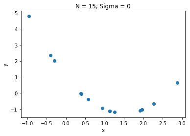
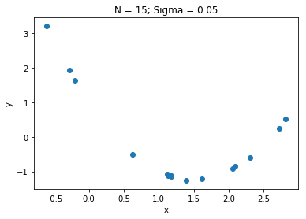
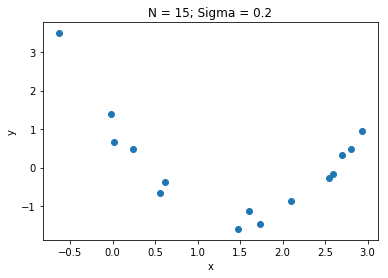
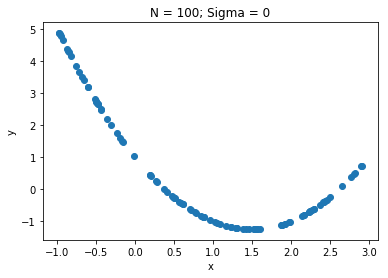
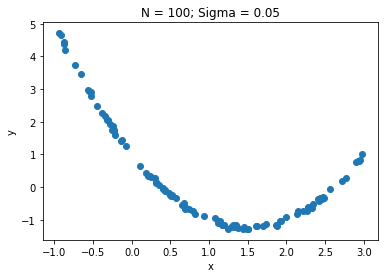
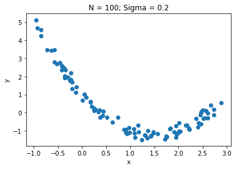
```

3.  Find the optimal weights (in terms of MSE) for fitting a polynomial function to the data in all 6 cases generated above using a polynomial of degree 1, 2, and 9. Use the equation given above. Include your code in prob2 3.py. Do not use built-in methods for regression. Plot the fitted curves on the same plot as the data points (you can plot all 3 polynomial curves on the same plot). Report the fitted weights and the MSE in tables. Do any of the models overfit or underfit the data?

See `prob2_2_3.py` for the python code for this problem.

```{r}
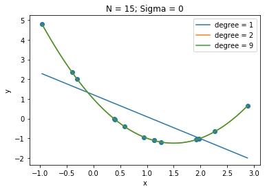
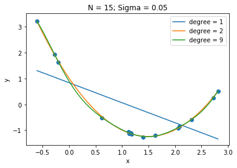
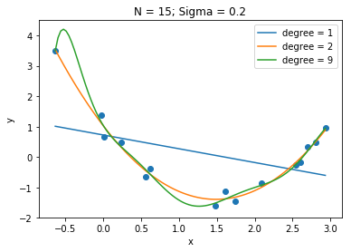
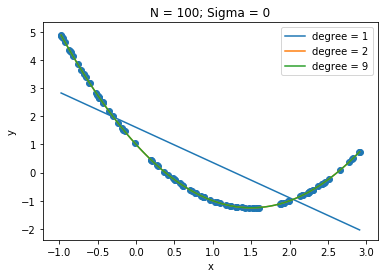
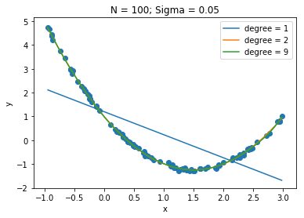
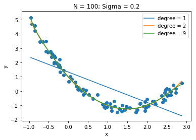
```

Fitted weights are displayed in the tables below:

N = 15, degree = 1

 $w_i$|  $\sigma = 0$ | $\sigma = 0.05$ | $\sigma = 0.2$
------|---------------|-----------------|---------------
$w_0$ | 1.209         | 0.836           | 0.726 
$w_1$ | -1.116        | -0.774          | -0.45

N = 15, degree = 2

 $w_i$|  $\sigma = 0$ | $\sigma = 0.05$ | $\sigma = 0.2$
------|---------------|-----------------|---------------
$w_0$ | 1.00          | 1.006           | 1.035
$w_1$ | -3.00         | -3.011          | -3.260
$w_2$ | 1.00          | 1.006           | 1.095

N = 15, degree = 9

 $w_i$|  $\sigma = 0$ | $\sigma = 0.05$ | $\sigma = 0.2$
------|---------------|-----------------|---------------
$w_0$ |1.00e+00       | 0.889           | 1.044
$w_1$ |-2.997e+00     | -3.344          | -4.051
$w_2$ |9.999e-01      | 1.920           | 6.343
$w_3$ |-8.498e-09     | 0.648           | -6.902
$w_4$ |5.262e-08      | -2.110          | -6.641
$w_5$ |-1.956e-08     |  0.685          | 19.824
$w_6$ |-4.633e-08     |  0.927          | -16.262
$w_7$ |4.889e-08      | -0.811          | 6.354
$w_8$ |-1.740e-08     |  0.238          | -1.219
$w_9$ |2.132e-09      | -0.0245         | 0.092


N = 100, degree = 1

 $w_i$|  $\sigma = 0$ | $\sigma = 0.05$ | $\sigma = 0.2$
------|---------------|-----------------|---------------
$w_0$ | 1.607         | -0.968          | -1.062
$w_1$ | -1.251        | 1.199           | 1.328

N = 100, degree = 2

 $w_i$|  $\sigma = 0$ | $\sigma = 0.05$ | $\sigma = 0.2$
------|---------------|-----------------|---------------
$w_0$ | 1.00          | 1.00            | 1.010
$w_1$ |  -3.00        | -2.991          | -3.043
$w_2$ | 1.00          | 0.997           | 1.017

N = 100, degree = 9

 $w_i$|  $\sigma = 0$ | $\sigma = 0.05$ | $\sigma = 0.2$
------|---------------|-----------------|---------------
$w_0$ |  1.00         | 9.866           | 0.968
$w_1$ |  -3.00        | -2.996          | -3.141
$w_2$ | 1.00          | 1.095           | 0.353
$w_3$ | 3.870         | 6.593           | -0.838
$w_4$ | 1.306         | -2.206          | 0.065
$w_5$ | -8.404        | 2.295           | 0.643
$w_6$ | -6.885        | 1.639           | -0.482
$w_7$ | 8.067         | -9.938          | 0.139
$w_8$ | -2.692        | 2.193           | -0.014
$w_9$ | 3.035         | -1.588          | 0.968

MSE values are in the following tables:


N = 15

$\sigma$        | degree = 1 | degree = 2 | degree = 9
----------------|------------|------------|-----------
$\sigma = 0$    |1.149       |9.79e-29    |2.352e-11   
$\sigma = 0.05$ |1.214       |0.003       |0.0005
$\sigma = 0.2$  |1.593       |0.016       |0.004


N = 100


$\sigma$        | degree = 1 | degree = 2 | degree = 9
----------------|------------|------------|-----------
$\sigma = 0$    |1.623       |5.854e-30   |5.338e-17 
$\sigma = 0.05$ |1.301       |0.002       |0.002 
$\sigma = 0.2$  |1.199       |0.039       |0.037  


The 9th degree polynomial fit on the N = 15, $\sigma = 0.2$ data seems to be overfitting the data. The 1st degree polynomial (i.e. linear regression model) underfits the data in every case. 