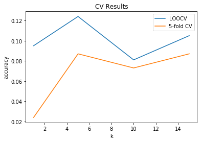
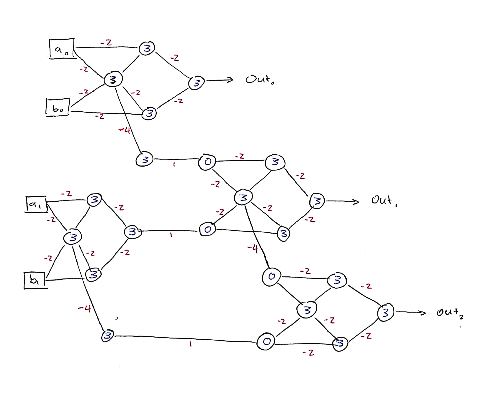

## Problem 1

Consider the setting that we had in problem 5 in Homework 1. In this problem, you will reuse the code you wrote in problem 5.2 to generate data from the same model. Fit a 9-degree polynomial model with L2 norm regularization to the cases with $\sigma^2 = 0.05$ and $N \in \{15, 100\}$, and include your code in `prob1.py`. Vary the parameter $\lambda$, and choose three values of $\lambda$ that result in the following scenarios: underfitting, overfitting, and an appropriate fit. Report the fitted weights and the MSE in each of these scenarios. 

The first column corresponds to underfitting, the second to overfitting, the third to an appropriate fit.

N = 15 |$\lambda = 10$| $\lambda = -0.005$ | $\lambda = 0.05$
------ | -----------  | ------------------ | ----------------
$w_0$  |    0.433     |       0.824        |   7.613e-01    
$w_1$  |   -0.491     |      -3.725        |  -2.703e+00   
$w_2$  |    0.099     |       1.879        |   1.112e+00   
$w_3$  |   -0.249     |       1.539        |  -2.565e-01   
$w_4$  |    0.025     |      -0.698        |   5.205e-01   
$w_5$  |   -0.097     |      -0.549        |  -4.285e-01   
$w_6$  |    0.058     |      -1.177        |   5.832e-02   
$w_7$  |    0.003     |       1.682        |   3.534e-02   
$w_8$  |   -0.001     |      -0.658        |  -6.120e-03   
$w_9$  |   -0.0006    |       0.083        |  -6.284e-04
------ | ------------ | ------------------ | ----------------
MSE    |  0.984       |      0.026         |   0.030


The first column corresponds to underfitting, the second to overfitting, the third to an appropriate fit.
 
N = 100|$\lambda = 50$|$\lambda = 0.05$| $\lambda = 1$
------ | -----------  | -------------  | ------------
$w_0$  | 6.096e-01    |     1.560      |   8.894e-01    
$w_1$  | -7.765e-01   |    -3.202      |  -2.627   
$w_2$  |  1.680e-01   |     1.875      |   7.785e-01      
$w_3$  | -4.071e-01   |     0.296      |  -4.598e-01      
$w_4$  |  1.164e-01   |    -1.622      |   3.958e-01      
$w_5$  | -1.725e-01   |     0.529      |  -1.512e-03      
$w_6$  |  2.046e-01   |     0.874      |   4.143e-02      
$w_7$  | -6.423e-02   |    -0.779      |  -1.108e-01      
$w_8$  |  4.178e-03   |     0.236      |   4.855e-02      
$w_9$  |  4.303e-04   |    -0.025      |  -6.336e-03  
------ | ------------ | -------------- | ----------------
MSE    |  0.997       |    0.0427      |   0.055

*Hint:* Linear regression with L2 norm regularization is also referred to as ridge regression.

## Problem 2

1. Load the dataset from file `assignment2.zip`

2. Write a program that applies a $k$-nn classifier to the data with $k \in \{1, 5, 10, 15\}$. Calculate the test error using both leave-one-out validation and 5-fold cross validation. Plot the test error as a function of $k$. You may use the existing models in scikit-learn or other libraries for finding the $k$-nearest neighbor, but do not use any built-in $k$-nn classifiers. Also, do not use any existing libraries or methods for cross validation. Do any values of $k$ result in underfitting or overfitting?

Python code is located in `prob2.py`. 

It seems that low values of $k$ may be overfitting the data slightly. The test error levels out towards the higher levels of $k$. 

```{r, echo = FALSE}

```


3. Apply two other classifiers of your choice to the same data. Possible algorithms include (but are not limited to) logistic regression, QDA, naive Bayes, SVM, and decision trees. You may use any existing libraries. Use 5-fold cross validation to calculate the test error. Report the training and test errors. If any tuning parameters need to be selected, use cross-validation and report the training and test error for several values of the tuning parameters. Which of the classifiers performed best? Did any of them underfit or overfit the data? How do they compare to the $k$-nn classifiers in terms of performance? 

Python code is located in `prob2_3.py`. 

I applied logistic regression and random forests to these data. No tuning parameters are needed for either of these classifiers. The training and test errors for 5-fold cross validation are shown in the table below.

Classifer           | Training Error | Test Error
------------------- | -------------- | ----------
Random Forests      | 0.011          | 0.029
Logistic Regression | 0.091          | 0.116

Random forests performed about as well as the $k$-nn classifier. Logistic regression did poorly than both the random forests and the $k$-nn classifier. When used to classify the training data, both classifiers overfit a little bit. However, as the test error wasn't dramatically lower than the training error, any slight overfitting that did occur was insignificant. 

## Problem 3

1. Suppose we have random variables $X_1, ..., X_n$ that are independent and identically distributed each with mean $\mu$ and variance $\sigma^2$. In this setting, the variables $X_i$ can be viewed as data points sampled in such a way that we expect each data point to be drawn from the same distribution. In general, we do not know this distribution including its properties such as the mean and variance. Thus if we want to know these properties, we need to estimate them from the data. 

Suppose that we wish to estimate some parameter $c$ with an arbitrary estimator $\hat{c}$. Since the estimator depends on the data, it is also a random variable. the $bias$ of this estimator is equal to $E[\hat{c}] - c$.

Define the following:

$$
\bar{X} = \frac{1}{n}\sum\limits_{i = 1}\limits^nX_i.
$$

$\bar{X}$ is an estimator of $\mu$. Calculate the bias of $\bar{X}$.

The bias of $\bar{X}$ will be $E[\bar{X}] - \mu$. 
Then, using the properties of expected values (sometimes called linearity properties), and remembering that the expected values of a sum is equal to the sum of the expected values:
$$
\begin{aligned}
E[\bar{X}] &= E\left[\frac{1}{n}\sum_{i = 1}^{n} X_i\right] \\
&= \frac{1}{n}E\left[\sum_{i = 1}^{n} X_i\right] \\
&= \frac{1}{n}\sum_{i = 1}^{n} E[X_i]
\end{aligned}
$$
We were told that $X_1, ..., X_n$ are identically distributed with mean $\mu$. Thus, for any $i$, $E[X_i] = \mu$.

Thus,
$$
\begin{aligned}
E[\bar{X}] &= \frac{1}{n}\sum_{i = 1}^{n} E[X_i] \\
&= \frac{1}{n}\sum_{i = 1}^{n} \mu \\
&= \frac{1}{n}n\mu\\
&= \mu \\
\implies E[\bar{X}] &=\mu.
\end{aligned}
$$
Then, using what we found about $E[\bar{X}]$ to find the bias, 

$$
E[\bar{X}] - \mu = \mu - \mu = 0
$$
Thus, the bias of $\bar{X}$ is 0. In other words, $\bar{X}$ is an unbiased estimator of $\mu$.

2. Calculate the variance of the estimator $\bar{X}$.

$$
\begin{aligned}
Var[\bar{X}] &= Var\left[\frac{1}{n}\sum_{i = 1}^{n} X_i\right] \\
&= \frac{1}{n^2}Var\left[\sum_{i = 1}^{n} X_i\right] \\
\end{aligned}
$$
Because $X_1, ..., X_n$ are independent, and identically distributed with $Var[X_i] = \sigma^2$,
$$
\begin{aligned}
Var[\bar{X}] &=\frac{1}{n^2}\sum_{i = 1}^{n} Var[X_i]\\
&= \frac{1}{n^2}n\sigma^2\\
&= \frac{\sigma^2}{n}\\
\implies Var[\bar{X}] &= \frac{\sigma^2}{n}.
\end{aligned}
$$

*Hint*: The variance of the sum of independent random variables is equal to the sum of the variances. 

3. The mean squared error (MSE) of an estimator is equal to the square of its bias plus the variance. What is the MSE of the estimator $\bar{X}$?

$$
\begin{aligned}
MSE(\bar{X}) &= (bias[\bar{X}])^2 + Var[\bar{X}]\\
&= 0 + \frac{\sigma^2}{n}\\
\implies MSE(\bar{X}) &= \frac{\sigma^2}{n}
\end{aligned}
$$

4. Consider the following estimator of $\sigma^2$:

$$
\hat{s}^2 = \frac{1}{n}\sum_{i = 1}^n(X_i - \bar{X})^2.
$$

Calculate the bias of $\hat{s}^2$. If this estimator is biased, is there a way to define a new estimator of $\sigma^2$ that is unbiased?

In order to find the bias, we will first compute the expected value of $\hat{s}^2$.

$$
\begin{aligned}
E[\hat{s}^2] &= E\left[\frac{1}{n}\sum_{i = 1}^n(X_i - \bar{X})^2\right] \\
&= \frac{1}{n}E\left[\sum_{i = 1}^n(X_i - \bar{X})^2\right]
\end{aligned}
$$
Expanding the squared term, and multiplying both sides by $n$:
$$
\begin{aligned}
nE[\hat{s}^2] &= E\left[\sum_{i = 1}^n(X_i - \bar{X})(X_i - \bar{X})\right] \\
&= E\left[\sum (X_i^2 -2X_i\bar{X} + \bar{X}^2)\right] \\
&= E\left[\sum X_i^2 -2\sum X_i\bar{X} + \sum\bar{X}^2\right] \\
&= E\left[\sum X_i^2 -2\bar{X}\sum X_i + n\bar{X}^2\right]
\end{aligned}
$$
Recall that $\sum X_i = n\bar{X}$. Thus, we can make the following substitution in the middle term:
$$
\begin{aligned}
nE[\hat{s}^2] &= E\left[\sum X_i^2 -2n\bar{X}^2 + n\bar{X}^2\right]\\
&= E\left[\sum X_i^2 -n\bar{X}^2 \right]
\end{aligned}
$$
Further simplifying, and remembering that $E(X_i^2)$ will be the same value, regardless of $i$,
$$
\begin{aligned}
nE[\hat{s}^2] &= \sum E(X_i^2) -nE(\bar{X}^2) \\
nE[\hat{s}^2]&= nE(X_i^2) - nE(\bar{X}^2) \\
E[\hat{s}^2] &= E(X_i^2) - E(\bar{X}^2) \\
\end{aligned}
$$
Recall now, that for some random variable, $Y$, $Var(Y) = E(Y^2) - [E(Y)]^2 \implies E(Y^2) = Var(Y) + E(Y)^2$. We can substitue this in for both terms in our equation, letting $Y = X_i$ in the first term, and $Y = \bar{X}$ in the second. 

$$
\begin{aligned}
E[\hat{s}^2] &= E(X_i^2) - E(\bar{X}^2) \\
&= Var(X_i) + E(X_i)^2 - (Var(\bar{X}) + E(\bar{X}))
\end{aligned}
$$
It is known that $Var(X_i) = \sigma^2$. We find the variance of $\bar{X}$ as follows:
$$
\begin{aligned}
Var(\bar{X}) &= Var\left(\frac1n\sum X_i\right) \\
&= \frac{1}{n^2}\sum Var(X_i) \\
&=\frac{1}{n^2}n\sigma^2 \\
&=\frac{\sigma^2}{n}
\end{aligned}
$$
Recall also that $E(X_i) = E(\bar{X}) = \mu$.Plugging in these values for the variances, and expected values,
$$
\begin{aligned}
E[\hat{s}^2] &= Var(X_i) + E(X_i)^2 - (Var(\bar{X}) + E(\bar{X})) \\
&= \sigma^2 + \mu^2 - \frac{\sigma^2}{n} - \mu^2 \\
&= \sigma^2 - \frac{\sigma^2}{n} \\
&= {\sigma^2}\left(1 - \frac{1}{n}\right) \\
E[\hat{s}^2] &= {\sigma^2}\left(\frac{n - 1}{n}\right) \\
\end{aligned}
$$
Thus, $\hat{s}^2$ is a biased estimator of $\sigma^2$, as $E[\hat{s}^2] \neq \sigma^2$. 
The actual bias can be found as follows:
$$
\begin{aligned}
bias &= E[\hat{s}^2] - \sigma^2 \\
&={\sigma^2}\left(\frac{n - 1}{n}\right) - \sigma^2
\end{aligned}
$$
In order to get an unbiased estimator of $\sigma^2$, we can multiply $\hat{s}^2$ by the reciprocal of the `leftover' term in $E[\hat{s}^2]$: $\frac{n}{n-1}$.

$$
\begin{aligned}
\frac{n}{n-1}\frac{1}{n}\sum_{i = 1}^n(X_i - \bar{X})^2\\
\frac{1}{n-1}\sum_{i = 1}^n(X_i - \bar{X})^2
\end{aligned}
$$
Thus, an unbiased estimator of $\sigma^2$, we will call it $\hat{s_1}^2$, is:
$$
\hat{s_1}^2 = \frac{1}{n-1}\sum_{i = 1}^n(X_i - \bar{X})^2
$$

## Problem 4

1. Suppose we take all the weights and biases in a network of perceptrons, and multiply them by a positive constant, $c > 0$. Show that the behavior of the network doesn't change.

*Hint*: Consider a single perceptron first. For a fixed input, does multiplying the weights and bias by a positive constant change the output of the perceptron? Now argue that the output of the entire network is unchanged. 

Recall that for a single perceptron, the output is given by the equation:
$$
output = 
\begin{cases} 0 & \mbox{if } \mathbf{w}\cdot\mathbf{x} + b \leq 0 \\
1 & \mbox{if } \mathbf{w}\cdot\mathbf{x} + b > 0
\end{cases}
$$
This can be rearranged to give the equivalent statement that: 

$$
output = 
\begin{cases} 0 & \mbox{if } \mathbf{w}\cdot\mathbf{x} \leq -b \\
1 & \mbox{if } \mathbf{w}\cdot\mathbf{x}  > -b
\end{cases}
$$
Now, multiplying the weights, $\mathbf{w}$, and the bias, $b$, by some constant, $c > 0$, we obtain the following:

$$
output = 
\begin{cases} 0 & \mbox{if } c\mathbf{w}\cdot\mathbf{x} \leq -cb \\
1 & \mbox{if } c\mathbf{w}\cdot\mathbf{x}  > -cb
\end{cases}
$$
This is perfectly equivalent to the definition of the perceptron output without the constant $c$ multiplied by the weights and bias. Note that each side can simply be divided by $c$ get get back to the original definition of the perceptron output. Thus multiplying the weights and biases by some constant $c > 0$ will not change the output (0 or 1) of the perceptron. Note that the constant $c$ *must* be $> 0$ to maintain the inequality direction. 

This idea extends from a single perceptron to a multilayer network of perceptrons. Because each individual perceptron will still have the same binary output (with or without the constant $c$ applied to weights and biases) to feed into the next layer of perceptrons, and those perceptrons will also yield the same binary output, the output of the entire network will remain unchanged with or without all biases and weights being multiplied by some $c > 0$.  

2. Given the same setup of `problem 4.1` - a network of perceptrons - suppose that the overall input to the network of perceptrons has been chosen and fixed. Suppose the weights and biases are such that $wx + b \neq 0$ for the input x to any particular perceptron in the network. Now replace all the perceptrons in the network by sigmoid neurons, and multiply the weights and biases by a positive constant $c > 0$. Show that in the limit as $c \rightarrow \infty$ the behavior of this network of sigmoid neurons is exactly the same as the network of perceptrons. How can this fail when $wx + b = 0$ for one of the perceptrons?

*Hint*: Use a similar approach as in problem 4.1 where you first consider the behavior of a single sigmoid neuron and then extend to the entire network. 

Recall the two cases that exist when calculating the output of a perceptron, with some constant $c > 0$ multiplied by the weights and bias:

$$
output = 
\begin{cases} 0 & \mbox{if } c\mathbf{w}\cdot\mathbf{x} + cb \leq 0 \\
1 & \mbox{if } c\mathbf{w}\cdot\mathbf{x} + cb > 0
\end{cases},
$$
which can be re-written as 

$$
output = 
\begin{cases} 0 & \mbox{if } c\left(\mathbf{w}\cdot\mathbf{x} + b\right) \leq 0 \\
1 & \mbox{if } c\left(\mathbf{w}\cdot\mathbf{x} + b\right) > 0
\end{cases}.
$$

Then, for the sigmoid neuron, we will consider the same two cases as are present in the perceptron case. 

Case 1: $c\left(\mathbf{w}\cdot\mathbf{x} + b\right) \leq 0$

In this case, the sigmoid function can be written as follows
$$
\frac{1}{1 + \exp(-c\left(\mathbf{w}\cdot\mathbf{x} + b\right))}.
$$
Since $c\left(\mathbf{w}\cdot\mathbf{x} + b\right) \leq 0$, we can let $k = c(\mathbf{w}\cdot\mathbf{x} + b)$, and $k$ will be negative So, it follows that our sigmoid function can be written as
$$
\frac{1}{1 + \exp(k)}.
$$
As the constant $c \rightarrow \infty$, $k \rightarrow \infty$, and $1 + \exp(k) \rightarrow \infty$. As the denominator of the sigmoid function grows, the entire quantity will approach 0. Therefore, as $c \rightarrow \infty$, for this case, the sigmoid output $\rightarrow 0$, and the sigmoid neuron behaves the same as a perceptron would in this case.

Case 2: $c\left(\mathbf{w}\cdot\mathbf{x} + b\right) > 0$

Beginning in a similar place as we did for Case 1,
$$
\frac{1}{1 + \exp(-c\left(\mathbf{w}\cdot\mathbf{x} + b\right))}.
$$
Since $c\left(\mathbf{w}\cdot\mathbf{x} + b\right) > 0$, we can let $k = c(\mathbf{w}\cdot\mathbf{x} + b)$, and $k$ will be positive. So, it follows that our sigmoid function can be written as
$$
\frac{1}{1 + \exp(-k)}.
$$
As the constant $c \rightarrow \infty$, $k \rightarrow \infty$, and $\exp(-k) \rightarrow 0$. As $\exp(-k)$ approaches 0, the denominator of the sigmoid function shrinks to 1, and the entire quantity will approach 1. Therefore, as $c \rightarrow \infty$, for this case, the sigmoid output $\rightarrow 1$, and the sigmoid neuron behaves the same as a perceptron would in this case.

If each individualsigmoid neuron behaves just like a perceptron (as described in the two cases above), then the entire network of sigmoid neurons would behave in the same way as an entire network of perceptrons.  

As is noted in the prompt for this problem, if $\mathbf{w\cdot x} + b = 0$, then the network of sigmoid neurons would fail to match the output of a network of perceptrons. This would happen because, no matter the value of $\mathbf{w\cdot x} + b$, we would have the following: 

$$
\begin{aligned}
& \frac{1}{1 + \exp(-c(\mathbf{w\cdot x} + b))} \\
\implies & \frac{1}{1 + \exp(-c(0))}\\
\implies & \frac{1}{1 + \exp(0)}\\
\implies & \frac{1}{2}.
\end{aligned}
$$
Thus, even as $c \rightarrow \infty$, the output will always be $\frac12$. This cannot simulate a network of perceptrons, since perceptrons always output a 1 or a 0. 

3. For each possible input of the MLP in Figure 1, calculate the output. I.e., what is the ouptut if $X = [0, 0, 0], [0, 0, 1]$, etc. You should have 8 cases total. 

$X$         | Output
----------- | ------
$[0, 0, 0]$ | 0
$[1, 0, 0]$ | 1
$[0, 1, 0]$ | 1
$[0, 0, 1]$ | 1
$[1, 1, 0]$ | 1
$[0, 1, 1]$ | 1
$[1, 0, 1]$ | 0
$[1, 1, 1]$ | 1

4. If we change the perceptrons in Figure 1 to sigmoid neurons, what are the outputs for the same inputs (e.g. inputs of $[0, 0, 0], [0, 0, 1], ...$)?

$X$         | Output
----------- | ------
$[0, 0, 0]$ | 0.5693
$[1, 0, 0]$ | 0.5699
$[0, 1, 0]$ | 0.6225
$[0, 0, 1]$ | 0.585
$[1, 1, 0]$ | 0.6173
$[0, 1, 1]$ | 0.6331
$[1, 0, 1]$ | 0.5751
$[1, 1, 1]$ | 0.6283

5. Using perceptrons with appropriate weights and biases, design an adder that does two-bit binary addition. That is, the adder takes as input two two-bit inary numbers (i.e. 4 binary inputs) and adds them together. Don't forget to include the carry bit. The resulting output should be the two-bit sum and the carry bit for a total of three binary outputs. 

*Hint*: You may want to consult the introduction slides for how to design a 1-bit adder using perceptrons. 

The diagram below shows an adder that does two-bit binary addition. For two two-bit binary numbers, $A$ and $B$, with digits $\{a_1a_0\}$ and $\{b_1b_0\}$ respectively. Then the sum of $A$ and $B$ will be given by concatenating the binary numbers output in the diagram below, $\{out_2out_1out_0\}$.

```{r, echo = FALSE}

```

